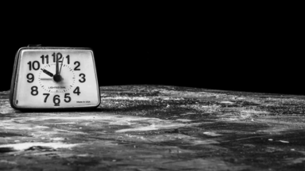

# Ghost clock

<!--- These are examples. See https://shields.io for others or to customize this set of shields. You might want to include dependencies, project status and licence info here --->


<!---->

Ghost clock always shows you the current time on your desktop background. 

When executing the script, it produces an image of a clock showing the current time. 
As soon ghost clock is installed, a clock image will be generated every minute and set to your desktop background. This makes your desktop spitting.




## Installing ghost clock

To install ghost clock, follow these steps:

Linux:
```
git clone https://github.com/mab9/ghost-clock.git
...

```

## Explanation of commands 

This command sets the image to the background. the image must be in the /usr/share/backgrounds folder. Otherwise the background change will not work.

    gsettings set org.gnome.desktop.background picture-uri file:///usr/share/backgrounds/clock.jpg

This command does resize the image so that it fits to the display.
    
    gsettings set org.gnome.desktop.background picture-options "zoom"
    http://danilodellaquila.com/en/blog/how-to-automatically-change-your-desktop-background-wallpaper


Arbeiten mit verschiedenen layers

    convert  c.jpg h.jpg -geometry +250+250 -composite r.png

Resize 

    convert wecker.jpg -resize 1000 w.jpg

Drehen der bilder

    convert -rotate 90 in.jpg out.jpg
  
Rotate and set background transparent

    convert -background 'rgba(0,0,0,0)' -rotate 105 clock-zeiger-h-original-v2.png h.png
  
Get image width

    identify -format "%w" c.png 

  
Cronjob 

    crontab -e * * * * * /compose-clock.sh
    https://www.cyberciti.biz/faq/how-to-run-cron-job-every-minute-on-linuxunix/


Gif image with convert
    
    convert -loop 0 -delay 100 in1.png in2.png out.gif
    convert -delay 25 -loop 0 -resize 20% ghost-clock-{1.23}-{0..59}.png ghost-clock.gif


## Contributing to ghost clock

<!--- If your README is long or you have some specific process or steps you want contributors to follow, consider creating a separate CONTRIBUTING.md file--->
To contribute to ghost clock, follow these steps:

1. Fork this repository.
2. Create a branch: `git checkout -b <branch_name>`.
3. Make your changes and commit them: `git commit -m '<commit_message>'`
4. Push to the original branch: `git push origin ghost-clock/<location>`
5. Create the pull request.

Alternatively see the GitHub documentation on [creating a pull request](https://help.github.com/en/github/collaborating-with-issues-and-pull-requests/creating-a-pull-request).

## My next ideas

- finish readme, add gif
- provide solid installation description

## Contributors

Thanks to the following people who have contributed to this project:

* [@mab9](https://github.com/mab9) 📖

<!-- You might want to consider using something like the [All Contributors](https://github.com/all-contributors/all-contributors) specification and its [emoji key](https://allcontributors.org/docs/en/emoji-key). -->

## Contact

If you want to contact me you can reach me at **marcantoine.bruelhart@gmail.com.**

## License
<!--- If you're not sure which open license to use see https://choosealicense.com/--->

This project uses the following license: [GNU GPLv3](https://choosealicense.com/licenses/gpl-3.0/).


